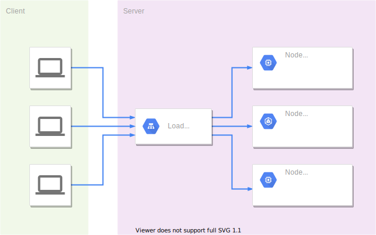

# 你，識字嗎？ api server 架構分享

這是我們這隊玉山人工智慧挑戰賽2021夏季賽【:dizzy:最佳API服務獎】的說明文件，主要關注 API 的部分，關於模型訓練請參考 [BruceJian43/TBrain2021-Chinese-Character-Recognition](https://github.com/BruceJian43/TBrain2021-Chinese-Character-Recognition)。

## 設計理念

我們用 Flask 建立 application，並用 gunicorn 部署。為了以 ensemble 提高變準確度，但又維持 throughput，我們設計了 load balancer，分配 request 給不同機器運算。

## 架構

#### 機器規格

| key          | value                                 |
| ------------ | ------------------------------------- |
| Machine type | e2-highcpu-16 (16 vCPU, 16 GB memory) |
| Zone         | asia-east1-b                          |
| Image        | Debian GNU/Linux 10 (buster)          |

#### 系統架構圖



1. load balancer 收到 request
2. load balancer 分配 request 給其他 node
3. node 按照演算法回傳 response 給 load balancer
4. load balancer 回傳 response

## Usage

individual node:

```
usage: api.py [-h] --primary PRIMARY [PRIMARY ...] [--primary-threshold PRIMARY_THRESHOLD]
              [--prelim PRELIM [PRELIM ...]] [--prelim-threshold PRELIM_THRESHOLD]
              [--max-workers MAX_WORKERS] [--training-data-dic TRAINING_DATA_DIC] [--data DATA]
              [--captain-email CAPTAIN_EMAIL] [--salt SALT]

optional arguments:
  -h, --help            show this help message and exit
  --primary PRIMARY [PRIMARY ...]
                        primary checkpoints to ensemble (default: None)
  --primary-threshold PRIMARY_THRESHOLD
                        (default: 0.28)
  --prelim PRELIM [PRELIM ...]
                        prelim checkpoints to ensemble (default: None)
  --prelim-threshold PRELIM_THRESHOLD
                        (default: 0.7)
  --max-workers MAX_WORKERS
                        The maximum number of processes that can be used to execute the predict
                        function calls (default: 1)
  --training-data-dic TRAINING_DATA_DIC
  --data DATA           directory to save requests and responses (default: data)
  --captain-email CAPTAIN_EMAIL
  --salt SALT
```

If `--training-data-dic /path/to/training data dic.txt` is specified, predictions not in `training data dic.txt` will be converted to "isnull".

Additional arguments will be passed as gunicorn settings (bind, threads, timeout, etc.).

If not specified, captain email, salt, and other gunicorn settings will be loaded from [`config.py`](src/config.py).

Example:

```bash
python3 --primary inception_v3_primary/models/best_macro_average_f1.ckpt dm_nfnet_f0_primary/models/best_macro_average_f1.ckpt repvgg_b3g4_primary/models/best_macro_average_f1.ckpt resnetv2_101x1_bitm_primary/models/best_macro_average_f1.ckpt --prelim repvgg_b3g4_prelim/models/best_macro_average_f1.ckpt --training-data-dic 'training data dic.txt' --bind '0.0.0.0:24865'
```

load balancer:

```
usage: balance.py [-h] [--netloc NETLOC [NETLOC ...]] [--max-workers MAX_WORKERS]

optional arguments:
  -h, --help            show this help message and exit
  --netloc NETLOC [NETLOC ...]
                        netloc of api server node (default: None)
  --max-workers MAX_WORKERS
```

If `--max-workers` is not specified, it will be 4 * number_of_netlocs.

Additional arguments will be passed as gunicorn settings (bind, threads, timeout, etc.).

If not specified, netlocs and other gunicorn settings will be loaded from [`config.py`](src/config.py).

Example:

```bash
python3 balance.py --netloc ADDRESS1 ADDRESS2 --bind '0.0.0.0:44966' --threads 120
```

# Classifier

因為不同模型可能有不同運作方式，所以我們設計了一個分類器的架構，讓 API 能自己獨立並維持系統性。

#### CLASS classifiers.Classifier

Base class of a classifer.

The API does the following procedure to initialize the classifer.

```python
state_dict = torch.load(f, map_location='cpu')
classifier = getattr(classifers, state_dict['name'])()
classifier.load_state_dict(state_dict)
```

The API calls `classify(image)` to classify an image.

- `classify(image)`

  Recognize the text content in the image.

  - Parameters

    image (numpy.ndarray) – the single image to predict

  - Returns

    the prediction of the image

  - Return type

    string

- `load_state_dict(state_dict)`

  Set up the classifier here.

  - Parameters

    state_dict (dict) – a dict containing the things required for setting up.

- `state_dict()`

  Returns a dictionary containing a whole state of the classifier.

  Generally you should include the following in the dictionary:

  - the name of the classifier
  - the module's state_dict
  - the label information
  - any other stuff required for classifying an image